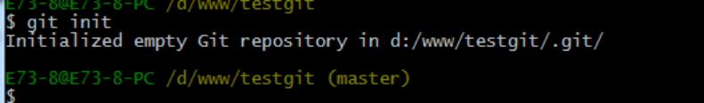
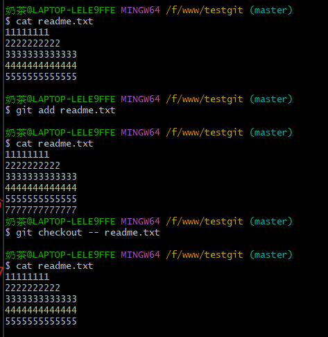

# git学习笔记
## 一、Git是什么？
Git是目前世界上最先进的分布式版本控制系统,Git是分布式版本控制系统，无中央服务器，每个人的电脑就是一个完整的版本库，工作时无需联网且便于文件更改后协作，便于分支与合并。

Workspace：工作区
Index / Stage：暂存区
Repository：仓库区（或本地仓库）
Remote：远程仓库

*工作区和暂存区的区别：*
工作区(WorkSpace)：在电脑上看到的目录，比如目录下testgit里的文件(.git隐藏目录版本库除外)。或者以后需要再新建的目录文件等等都属于工作区范畴

版本库(Repository)：工作区有一个隐藏目录.git,这个不属于工作区，这是版本库。其中版本库里面存了很多东西，其中最重要的就是stage(暂存区)，还有Git为我们自动创建了第一个分支master,以及指向master的一个指针HEAD

## 二、Git相关操作
**1、创建仓库**
把当前目录变成git可以管理的仓库：命令 git init

*注意：不可手动更改.git目录中的文件，否则会把git仓库破坏*

（1）提交文件方法：
第一步：使用命令 git add readme.txt添加到暂存区里面去
第二步：用命令 git commit告诉Git，把文件提交到仓库

（2）查看方法
命令git status

（无未提交文件）

（有未提交文件，修改后文件未提交）

（3）查看文件修改：git diff readme.txt

**2、版本回退**
（1）查看提交历史记录：git log

简洁化信息：git log –pretty=oneline

注意：修改完成后要先保存修改（笔记本退出时弹出保存按钮），再进行add、commit、log等步骤

回退到上个版本：git reset --hard HEAD^ 
要回退到前100个版本：git reset --hard HEAD~100 
回退至指定版本：git reset --hard 版本号
当版本号未知时：git reflog产看版本号，查看后再回退

修改文件后，使用git提交文件的步骤提交到版本库

**3、Git撤销修改和删除文件操作**
（1）撤销修改
方法：
法一：直接手动更改去掉那些需要的文件，然后add添加到暂存区，最后commit
法二：按以前的方法直接恢复到上一个版本，使用 git reset --hard HEAD^
法三：直接用撤销命令：git checkout -- file:可以丢弃工作区的修改

checkout的两种情况：
①readme.txt自动修改后，还没有放到暂存区，使用撤销修改就回到和版本库一模一样的状态
②readme.txt已经放入暂存区了，接着又作了修改，撤销修改就回到添加暂存区后的状态

*注意：命令git checkout -- readme.txt 中的 -- 很重要，如果没有 -- 的话，那么命令变成创建分支了*

（2）删除文件

**5、远程仓库**
第一步：创建SSH Key

第二步：将已创建的密匙添加到github(已完成注册)
第三步：添加远程仓库
完成后可实现本地仓库和Git仓库远程同步，同时便于与他人协作修改
Create a new repo（仓库名：testgit）->Create repository
根据GitHub的提示，在本地的testgit仓库下运行命令：

推送成功后，github页面远程库的内容和本地一样

从此，只要本地作了提交，就可以通过如下命令：
git push origin master
把本地master分支的最新修改推送到github上，拥有了真正的分布式版本库

